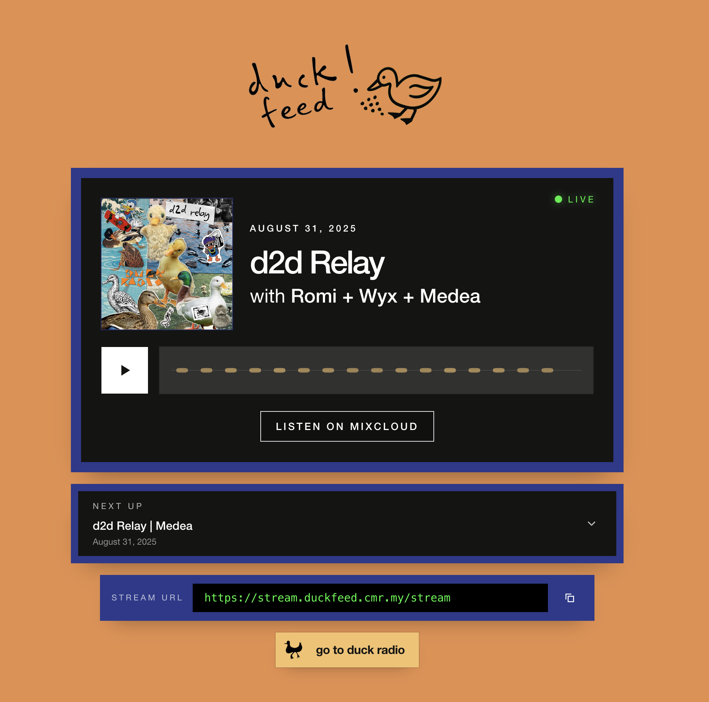

<p align="center">
  
</p>

# duckfeed

### self-hosted archive radio stack

Built for the Duck Radio archive, Duck Feed combines streaming, ingest, metadata, and administration in one small self-hosted system.

<p align="left">
  
</p>

Demo player: <https://duckfeed.cmr.my>

## What It Does

- **24/7 stream delivery**: Liquidsoap + Icecast serve archive audio continuously, with support for scheduled external live-source windows.
- **Public player**: a React SPA provides playback controls, artwork, stream status, archive browsing, runtime branding, and Mixcloud links.
- **Admin UI**: authenticated pages cover appearance, episodes, ingest, stream controls, rotation queue management, live scheduling, and integration API keys.
- **Local ingest pipeline**: uploaded or dropped audio is copied, normalized, validated, fingerprinted, and published into the stream library without mutating the original source.
- **Metadata repair**: a dedicated worker uses Mixcloud's JSON API to repair or backfill titles, presenters, dates, artwork, descriptions, and Mixcloud URLs.
- **Optional upstream archive**: Duckhaus can supply catalog metadata and prepared audio, which Duck Feed caches locally within a configured size budget.
- **Read-only integration API**: external sites and apps can fetch stream metadata through revocable API keys.

## Stack

- **Backend**: Node.js, TypeScript, Fastify, Drizzle ORM
- **Frontend**: React, TypeScript, Vite, Tailwind CSS
- **Database**: PostgreSQL 16
- **Streaming**: Liquidsoap + Icecast2
- **Audio tooling**: ffmpeg, fpcalc, AcoustID, MusicBrainz
- **Infra**: Docker Compose, Nginx

## Services

The main Compose stack contains:

- `postgres`
- `server`
- `ingest-worker`
- `metadata-worker`
- `client`
- `liquidsoap`
- `icecast`
- `nginx`

Duckhaus is an optional upstream service and lives outside this repository.

## Quick Start

1. Copy the environment template:

   ```bash
   cp .env.example .env
   ```

2. Set a real `SESSION_SECRET`:

   ```bash
   openssl rand -hex 32
   ```

3. Fill in the required database and Icecast credentials in `.env`.

4. Start the stack:

   ```bash
   make dev
   ```

5. In another terminal, run migrations and create an admin user:

   ```bash
   make db-migrate
   make seed-admin
   ```

6. Open:

- public player: `http://localhost`
- admin UI: `http://localhost/admin`
- direct stream: `http://localhost/stream`

## Runtime Flows

### Local ingest

- Upload audio in `/admin/ingest`, or drop files into the watched dropzone.
- The ingest worker copies the source, then normalizes, validates, fingerprints, and publishes stream-ready audio to the local library.
- Successful ingests become available for queueing and rotation.

### Optional Duckhaus sync/cache

- Duck Feed can sync episode metadata from Duckhaus and download prepared audio on demand.
- Cached audio is kept within `ROTATION_CACHE_MAX_BYTES`.
- Local ingest remains fully supported even when Duckhaus is disabled.

### Stream modes

- `archive`: local queue plus library playback
- `live`: scheduled external stream relay
- `offline`: Liquidsoap unreachable

The public player uses the unified stream snapshot endpoint and SSE updates to reflect mode and playback changes.

## Public API

- `GET /api/stream`: unified stream snapshot used by the SPA
- `GET /api/stream/status`
- `GET /api/stream/now-playing`
- `GET /api/stream/events`
- `GET /api/episodes`
- `GET /api/episodes/:slug`
- `GET /api/site-settings`
- `GET /api/site-assets/:filename`

## Admin Surfaces

- `/admin`: dashboard with stream and ingest overview
- `/admin/appearance`: colors, logo, favicon
- `/admin/episodes`: episode editing and track review
- `/admin/ingest`: uploads and ingest job history
- `/admin/stream`: request queue, rotation queue, restart/skip controls, integration keys
- `/admin/schedule`: live-source URL and weekly schedule management

## Stream Metadata Integration API

Read-only integration keys are managed in the admin UI or through the CLI:

```bash
make stream-api-key-list
make stream-api-key-create LABEL="Partner app"
make stream-api-key-revoke ID=<uuid>
```

Endpoints:

- `GET /api/stream/integration/metadata`
- `GET /api/stream/integration/now-playing`
- `GET /api/stream/integration/queue`

Example:

```bash
curl \
  -H "Authorization: Bearer dfs_your_key_here" \
  http://localhost/api/stream/integration/metadata
```

## Environment

Required:

- `POSTGRES_USER`
- `POSTGRES_PASSWORD`
- `POSTGRES_DB`
- `DATABASE_URL`
- `SESSION_SECRET`
- `ICECAST_SOURCE_PASSWORD`
- `ICECAST_ADMIN_PASSWORD`

Optional but important:

- `ACOUSTID_API_KEY`: enables fingerprint-based track suggestions
- `DUCKHAUS_BASE_URL`: enables upstream catalog sync and on-demand prepared-audio downloads
- `DUCKHAUS_API_TOKEN`: bearer token for Duckhaus
- `MIXCLOUD_USER_URL`: source archive used by metadata recovery
- `MUSICBRAINZ_CONTACT_URL`: public contact URL sent in MusicBrainz requests
- `BRANDING_DIR`: overrides the branding asset directory inside the server container
- `ROTATION_CACHE_MAX_BYTES`: caps the local cache budget for Duckhaus-backed audio

## Production Notes

- `docker-compose.prod.yml` keeps PostgreSQL, the API, and Icecast off public host ports while leaving Nginx as the edge container.
- The repository Nginx config is intentionally generic. Keep host-specific TLS and split-origin routing in local-only overrides.
- `make build` and `make deploy` automatically include `docker-compose.prod.local.yml` when it exists.
- For split-origin deployments, copy `docker-compose.prod.local.example.yml` to `docker-compose.prod.local.yml` and place host TLS server blocks under `nginx/conf.d-extra/`.
- If app, API, and stream use different public origins, set `ICECAST_HOSTNAME` appropriately and build the client with `client/.env.production`.

## Common Commands

```bash
make dev                 # start the full stack in development mode
make stop                # stop development services
make test                # run server and client tests
make lint                # run lint checks
make typecheck           # run TypeScript checks
make db-migrate          # run pending DB migrations
make seed-admin          # create/reset the admin user
make stream-check-quick  # fast public stream smoke test
make stream-check        # deeper stream validation
make link-check          # validate tracked Markdown links
make backup              # create a PostgreSQL backup
make build               # build production images
make deploy              # run the deploy script
```

## Project Layout

- `server/`: Fastify API, workers, database schema, migrations, services, and tests
- `client/`: React SPA for the public player and admin UI
- `liquidsoap/`: stream and live-source switching configuration
- `icecast/`: Icecast configuration
- `nginx/`: reverse proxy configuration
- `scripts/`: deploy, backup, restore, and verification helpers
- `docs/features/`: focused notes on stream, library, ingest, admin, and public behaviour

## License

MIT
